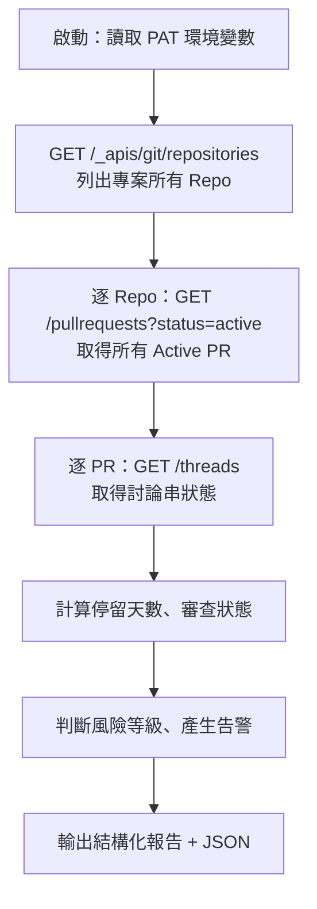

# PR Dashboard 管理者巡邏技能規劃

以 [azure-devops-patrol](file:///Users/isosoman/Documents/repo/deepwiki_claude/skillPlayground/.claude/skills/azure-devops-patrol/SKILL.md) 為範本，同樣用 **Python 腳本 + Azure DevOps REST API + PAT 認證**，不用任何 MCP 工具。

---

## 技能概述

| 項目 | 說明 |
|------|------|
| 技能名稱 | `azure-devops-pr-dashboard` |
| 目標 | 管理者角度，快速掌握專案所有 Repo 的 PR 健康狀態 |
| 觸發關鍵字 | `PR 狀態`、`PR 巡邏`、`PR dashboard`、`看看 PR`、`code review 狀況`、`審查進度` |
| 認證方式 | 環境變數 `AZURE_DEVOPS_PAT`（跟 patrol.py 一致） |

---

## 目錄結構

```
.claude/skills/azure-devops-pr-dashboard/
├── SKILL.md                       # 技能說明與執行指令
├── scripts/
│   └── pr_dashboard.py            # 主腳本，呼叫 REST API 產出報告
└── evals/
    └── evals.json                 # 測試案例
```

---

## 腳本設計：`pr_dashboard.py`

### 執行流程



### 使用的 REST API

| API | 用途 |
|-----|------|
| `GET {org}/{project}/_apis/git/repositories` | 列出專案下所有 Repo |
| `GET {org}/{project}/_apis/git/repositories/{repoId}/pullrequests?searchCriteria.status=active` | 取得 Repo 的 Active PR（含 reviewers、建立時間等） |
| `GET {org}/{project}/_apis/git/repositories/{repoId}/pullrequests/{prId}/threads` | 取得 PR 的討論串，計算未解決數量 |

全部都是 **GET 請求（唯讀）**，Phase 1 不做任何寫入操作。

### PR 明細欄位

對每個 Active PR 收集：

| 欄位 | 來源 |
|------|------|
| PR ID / 標題 | PR 物件 |
| 建立者 | `createdBy.displayName` |
| 來源 → 目標分支 | `sourceRefName` → `targetRefName` |
| 建立時間 | `creationDate` |
| ⏱️ 停留天數 | `now - creationDate` |
| 是否 Draft | `isDraft` |
| 審查者清單 | `reviewers[]` |
| 各審查者投票 | `reviewers[].vote`（0=未投、5=Approved with suggestions、10=Approved、-5=Waiting、-10=Rejected） |
| 未解決討論數 | threads 中 `status=active` 的數量 |

### 🚨 風險告警規則

| 告警 | 條件 | 建議 |
|------|------|------|
| 🔴 停滯 PR | 停留 > **5 天** | 催促審查者或拆分 PR |
| 🟡 長期未審 | 停留 > **3 天** 且無人投票 | 指派或 ping 審查者 |
| 🟠 未解決討論 | 有 Active thread 未關閉 | 開發者先處理討論 |
| ⚪ 無審查者 | 沒有指派 Reviewer | 管理者指派審查者 |
| 📝 Draft 過久 | Draft PR > **7 天** | 確認是否仍在開發 |

---

## 報告輸出範例

```
📊 PR Dashboard — 2026-07-04 23:00

📋 組織：isosoman0009 | 專案：dev
══════════════════════════════════════════════

📦 Repo: my-web-app (3 個 Active PRs)
┌─────┬────────────────────┬────────┬────────┬──────────────┬────────────┐
│ #ID │ 標題               │ 建立者 │ 停留   │ 審查狀態     │ 未解決討論 │
├─────┼────────────────────┼────────┼────────┼──────────────┼────────────┤
│ #42 │ 修正登入頁 CSS     │ alice  │ 🔴 7天 │ 0/2 已審     │ 3          │
│ #55 │ 新增 API 端點      │ bob    │ 🟡 3天 │ 1/2 已審     │ 0          │
│ #61 │ 更新 README        │ charlie│ ⚪ 1天 │ 無審查者     │ 0          │
└─────┴────────────────────┴────────┴────────┴──────────────┴────────────┘

📦 Repo: infra-scripts (0 個 Active PRs) ✅

🚨 風險告警：
  🔴 #42 (my-web-app) 已停留 7 天、3 個未解決討論 → 建議催促 reviewer
  ⚪ #61 (my-web-app) 無審查者 → 建議指派

💡 管理建議：
  • 有 1 個 PR 超過 5 天未完成，建議安排集中 Code Review
  • PR #42 與 #55 的目標分支都是 main，注意合併順序

--- PR_DASHBOARD_JSON ---
{ ... 結構化 JSON 供 Agent 解析 ... }
```

---

## Phase 2（延伸功能，後續再做）

在報告產出後，使用者可以下達指令，由 Agent 執行寫入操作：

| 操作 | REST API | 說明 |
|------|----------|------|
| 催促留言 | `POST .../threads` | 在停滯 PR 留下友善催促 comment |
| 指派審查者 | `PUT .../reviewers/{reviewerId}` | 為缺少 Reviewer 的 PR 指派 |
| 標記 Abandon | `PATCH .../pullrequests/{prId}` | 長期無活動的 PR 建議關閉 |

> **重要：** Phase 2 所有寫入操作都必須先問過使用者才執行。

---

## 待確認事項

1. **告警閾值**：停滯 5 天、未審 3 天、Draft 過久 7 天，是否合理？
2. **掃描範圍**：在 SKILL.md 中寫死目標 Repo 名稱
3. **組織/專案**：沿用 `isosoman0009` / `dev`
4. **第一版範圍**：先做 Phase 1 唯讀報告

---

## 實施步驟

| 步驟 | 內容 | 預估 |
|------|------|------|
| 1 | 寫 `scripts/pr_dashboard.py`（主腳本） | 15 分鐘 |
| 2 | 寫 `SKILL.md`（技能描述與執行指令） | 5 分鐘 |
| 3 | 寫 `evals/evals.json`（測試案例） | 5 分鐘 |
| 4 | 實測一輪 | 5 分鐘 |
